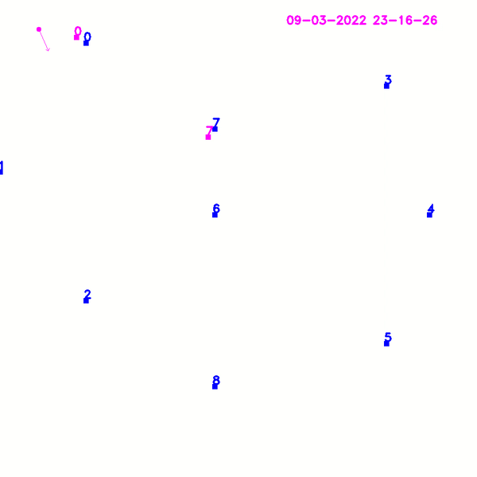
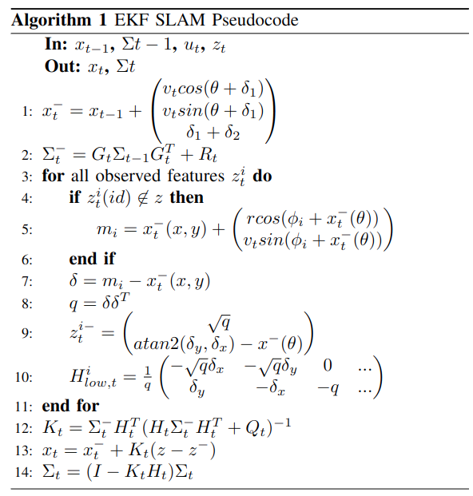
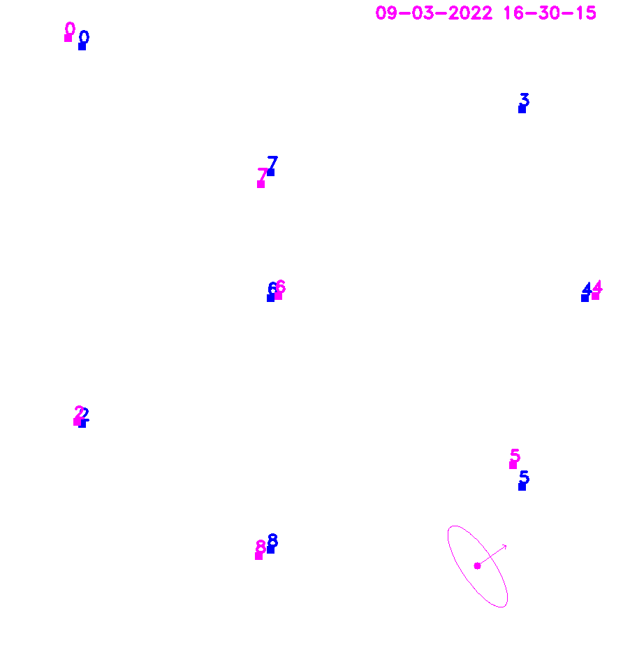

# Abstract
<p align="justify">
With the empirical Moore's law, the number of transistors in a dense integrated circuit doubles each year. However, Dennard's scaling law has been broken, and since 2005 the frequency has began to stagnate. The most common way to deal with this has been parallel computing, where operations are spread over multiple cores. This parallelization is becoming popular in robotics due to their concurrent nature. This report will study from a practical perspective how to apply parallelization for multiple tasks in a C++ robotics context, demonstrating its usefulness in a simplified Extended Kalman Filter SLAM framework.
</p>




# Introduction
<p align="justify">
C++ has become one of the most popular programming languages to robotics. It provides low real-time performance, Object Oriented Design capabilities and easier to manage low level control than C. Since C++11, multithreading is supported providing a simple interface to the programmer. The topic can be divided into two main areas, threading, and shared resources. 

On the one hand, threading provides the programmer with parallelization capabilities in multiple threads. Threads will be created when requested using multiple methods (functions, functors, lambda functions, async) and destroyed once the task is finished. 

On the other hand, understanding shared resources between multiple threads is essential in parallel programming, as they could lead to race conditions and wrong order of operations. This occurs as the optimizations performed to transform from code to machine instructions become observable, therefore mutexes and conditional variables become a way of handling these issues.

In order to fully understand the scope of the topic, a 2D Extended Kalman Filter SLAM framework has been developed with multiple added parallelizations. The performance will be compared, and the tradeoffs will be studied.
</p>

# Multithreading 
<p align="justify">
The creation of threads in C++ comes from `std::thread` library. It can be based in four main approaches, functions, functors, lambda functions and asynchronous tasks. 
</p>

## Using functions
<p align="justify">
When using a function in the thread creation, this function will be assigned to that thread taking its function parameters. There are two main cases for creating a thread using functions. Using a function, or using a class method. In both cases, if the argument is to be passed using the reference wrapper `std::ref`.

Using a function does not require any additional considerations. 

``` cpp
std::thread my_thread = std::thread(MyFunction, arg1, arg2, ref(arg3), ref(arg4))
```

When using a class method, the reference to the class method must be passed, as well as the instance in which it is being called. 

```cpp
std::thread my_class_thread = thread(&MyClass::MyFunction, class_instance, arg1, ref(arg2));
```

As soon as the thread is created, it will start processing. To wait for a thread to finish, it is necessary to use .join (`my_thread.join()`).

</p>

## Using functors
<p align="justify">

Similar to the creation of threads using functions, the functors will use instances of a class to perform certain operations instead of calling the same function with different inputs. The function operation will be defined in its `operator()` method.

```cpp
class MyFunctorClass {
 public:
  void operator()(uint64_t arg, uint64_t &arg2) {
    // do some operations and store them in _x
  }
  uint64_t _x;
};

MyFunctorClass *functor = new MyFunctorClass();
std::thread(std::ref(*functor), arg1, ref(arg2))

```
</p>

## Using lambda functions
<p align="justify">

An alternative way to initialize threads in a compact way is to use lambda functions. These provide inline functions without an identifier. It has four main components:

```cpp
[capture](parameters) return_type { function_body }
```

1. Capture: the output variables, can be references.
2. Parameters: arguments to the function (empty if none).
3. Return type (empty if none).
4. Function body.

The initialization of the thread is very similar to the previous cases.

```cpp
std::thread([arg1] (int x) {
      // do something with arg1
      return x;
})
```
</p>

## Using async
<p align="justify">

All the previous thread initializaiton methods are expected to run synchronously using the `.join()` method. But C++ also makes possible to run tasks asynchronously such that a receiver is notified after the task is finished. 

However, using `std::async` blocks the main thread until the computation is done. So how is this different from `std::thread`? 

There are two main points to note. First, `std::thread` does not give access to the function return value, while `std::async` returns a future whose value is obtained via `.get()`. Second, asynchronous calls can be implemented with an asynchronous policy, that can specify how existing threads are assigned. Meanwhile threading will always create a new thread.

The implementation would be as follows.

```cpp
std::future<int> task_result = std::async(MyAsyncTask, arg1, ref(arg2));
int data = task_result.get();
```
</p>

# Mutex and conditional variables
<p align="justify">
Using multiple threads can be of great advantage for task parallelization. However it doesn't come without drawbacks. Unlike processes, threads have a shared memory component that must be correctly handled by the programmer, otherwise potential deadlocks and race conditions will occur. 

Suppose the following simple scenario, two threads trying to change the same variable to a different value.

```cpp
auto t1 = std::thread([]() { g_x = 1; });
auto t2 = std::thread([]() { g_x = 2; });
```

The behaviors in this case is non-deterministic, as the variable could be assigned a different value depending on the order of execution of each thread.

Moreover, the operations are usually non-atomic. Changing a variable can be divided into multiple steps: 1) read from memory 2) change variable 3) set variable, and the operations can get interleaved.

The best optimization in this case is to reduce as much as possible the shared data between threads. This might not always be possible, thus mutexes, locks, atomic operations and abstraction levels help the programmer achieve this. This report will survey the most popular ones in this case, mutexes, locks and conditional variables.
</p>

## Mutexes and locks
<p align="justify">

Defining a mutex means to establish a critical section for a shared variable in which only one program at a time can access. There will be one mutex per critical section, and multiple critical sections can be established within a program.

It can be managed in C++ using direct locks, lock guards, shared locks, unique locks, multiple locks. 
</p>

### Direct lock:
<p align="justify">

The direct lock is the simplest form of a lock to access the mutex critical section. While one thread is holding a lock, the other will wait. However when an exception occurs, the mutex stays locked, causing a potential deadlock. In addition, it should be locked and unlocked manually by the programmer.

The definition of a direct lock can be defined as follows:

```cpp
std::mutex m;
unsigned long ct;

void Increment() {
    m.lock();
    ct++;
    m.unlock();
}
```
</p>

### Lock Guard
<p align="justify">

Lock guard handles the disadvantage from the direct lock by unlocking as soon as it goes out of scope. It follows the RAII programming technique (Resource Acquisition as Initialization), and avoids deadlock if an exception or error occurs.

```cpp
void main() {
    {
        std::lock_guard<std::mutex> guard(m);
        ct++;
    }
}
```
</p>

### Unique Lock (Lock Guard + Lock/Unlock)
<p align="justify">

The unique lock in C++ combines lock guard RAII with lock/unlock capabilities from the direct lock. It can be used to avoid long wait times where operations on non critical sections are being performed inside a function.

```cpp
void main() {
    {
        std::unique_lock<std::mutex> ul(m);
        ct++;
        ul.unlock();
        // non-critical stuff
        ul.lock();
    }
}
```
</p>

### Shared Lock
<p align="justify">

The shared lock allows for multiple reading operations from multiple threads, while having a single writer thread. In this strategy, the writer will hold a unique lock to enter the critical section until the task is finished. Then the readers will hold the shared lock to read the data. Note that the read and write operation cannot occur at the same time.

```cpp
std::shared_mutex m;
unsigned long ct;

// Unique lock for all the writers
void Increment() {
    for (int i = 0; i < 100; i++) {
        std::unique_lock<std::shared_mutex> ul(m);
        ct++;
    }
}


// Shared lock for all the readers
std::shared_lock<std::shared_mutex> sl(m);
std::cout << "Count: " << ct << endl;
```
</p>

### Multiple locks
<p align="justify">

When using multiple locks, there is a risk of a potential deadlock if not addressed properly. A popular example in this context is the dining philosophers problem.

In the following simple case, there are two functions in two threads that try to lock shared resources sequentially. `ThreadFunc1` proceeding will depend on `ThreadFunc2` unlocking m1, and `ThreadFunc2` proceeding will depend on `ThreadFunc1` unlocking m2, resulting in a deadlock.

```cpp
std::mutex m1, m2;
unsigned long ct;

void ThreadFunc1() {
    for (int i = 0; i < 100; i++) {
        std::unique_lock<std::mutex> lock1(m1);
        std::unique_lock<std::mutex> lock1(m2);
        ct++;
    }    
}

void ThreadFunc1() {
    for (int i = 0; i < 100; i++) {
        std::unique_lock<std::mutex> lock2(m2);
        std::unique_lock<std::mutex> lock2(m1);
        ct++;
    }    
}
```

A solution to this can be to use a scoped lock, that locks all mutex or none of them and releases once out of scope `std::scoped_lock(m1, m2)`.

</p>

## Conditional variables
<p align="justify">

Another sharing mechanism between threads has a producer/consumer pattern, in which one thread produces data and another one consumes it. Therefore there must be some synchronization between them. Shared memory and conditional variables can be used in this case.

</p>

### Shared memory:
<p align="justify">

First, regarding shared memory, a critical section is defined in which data is written and a flag is set. The producer puts data into the shared memory and sets a ready flag.  The consumer checks for ready flag, and consumes it when available.

The following implementation demonstrates its application in a visualization application for the current time.

```cpp
// consumer
void Drawer::DrawerLoop()
{
  while (!stop)
  { ...
    if (new_time) {
        DrawTime();
        SetReady(false);
    }
  }
}

// producer
void DisplayTime() {
    while(!stop) {
        string time = get_time();
        drawer->SetReady(true);
        drawer->SetNewTime(str);
    }
}
```
</p>

### Conditional variable:
<p align="justify">

The conditional variable improves the previous shared memory communication by setting a notifier in the critical section. It is based in a two way handshaking between producer and cosumer. The steps for a shared variable in `std::mutex m` are:

1. Create critical section variables (mutex, data, ready, condition variable)
2. Producer:
    a. Gets lock
    b. Produces data
    c. Sets ready flag to true
    d. Unlocks 
    e. Notifies consumer (`m.notify_one()` or `m.notify_all()`)
    f. (Optional) waits for response to continue producing
3. Consumer:
    a. Gets lock 
    b. If blocked, unlocks so that producer can take it (l.unlock())
    c. If unblocked, locks so that consumer can sample the data (l.unlock())
    e. Waits until ready & notification has been received `m.wait(lock1, []() { return ready;})`
    f. Gets data coming from the producer
    g. Unlocks the critical section 
    h. (Optional) notifies producer to continue producing
    i. Consumes the data 

Note that the wait function has the predicate `ready`, it is essential to avoid spurious wake ups by the OS. Spurious wake ups can cause race conditions by trying to access the same variable from the consumer and the producer.

Moreover, C++ sequential consistency (`unlock()` synchronizes with the next `lock()`) ensures that the notification will be seen by the other thread.


```cpp
std::mutex g_mutex;
std::condition_variable g_cv;
bool g_ready = false;
int g_data = 0;
void ConsumeData(int& data) {}

void Consumer() {
  int data = 0;
  for (int i = 0; i < 100; i++) {
    std::unique_lock<std::mutex> ul(g_mutex);

    // if blocked, ul.unlock() is automatically called.
    // if unblocked, ul.lock() is automatically called.
    g_cv.wait(ul, []() { return g_ready; });
    // Sample data
    data = g_data;
    std::cout << "data: " << data << std::endl;
    g_ready = false;
    ul.unlock();
    g_cv.notify_one();
    ConsumeData(data);
    ul.lock();
  }
}

void Producer() {
  for (int i = 0; i < 100; i++) {
    std::unique_lock<std::mutex> ul(g_mutex);

    // Produce data
    g_data = GenRandomValue();
    std::this_thread::sleep_for(std::chrono::milliseconds(100));

    g_ready = true;
    ul.unlock();
    g_cv.notify_one();
    ul.lock();
    g_cv.wait(ul, []() { return g_ready == false; });
  }
}
```
</p>

# Parallelized EKF-SLAM
<p align="justify">

After understanding all the practical concepts on C++ parallel
programming, it is time to observe how it can be applied to a real
scenario. This simulation will perform Simultaneous Localization and
Mapping (SLAM) of a robot in a 2D world. The robot measurement is based
on the odometry motion model, and a range-bearing sensor to observe the
landmarks. An introduction to the problem will be provided. The
parallelizable sections will be studied, and the performance will be
demonstrated.

The problem formulation is based on Cyrill Stachniss lecture on robot
mapping [1] (University of Freiburg) as well as
'Simultaneous localization and mapping with the extended Kalman filter'
by Joan Solà [2]. The sensor data was generated by the same
professor.
</p>

## EKF-SLAM
<p align="justify">

The Extended Kalman Filter was one of the first approaches of SLAM by
performing a local linearization of a nonlinear system. It couples the
current state of the robot only to the previous state and estimates is
probability of being at the current state. The algorithm is divided into
two main steps, prediction and correction.

The state vector has a 3 + 2N length where N is the number of
landmarks. It is defined as

)

Where ) are the coordinates of the landmarks.

The covariance matrix is 2N x 2N defined as


The input vector (odometry vector) is defined as
)


The measurements come in the form of id, range and bearing
), and they are interpreted as an unordered map
in the C++ code.

Note that all the measurements must come already asscociated into the
algorithm.
</p>

### Prediction step
<p align="justify">

In the prediction step, the estimated state is computed based on the
motion model and an initial uncertainty (covariance) matrix
is predicted from previous uncertainty and the motion model jacobian
G_t.

&space;\\&space;&space;&space;&space;v_t&space;sin(\theta&space;&plus;&space;\delta_1&space;)&space;\\&space;&space;&space;&space;\delta_1&space;&plus;&space;\delta_2&space;&space;&space;&space;&space;\end{pmatrix})


The jacobian of the motion model corresponds to the top-left component
of a 3 + 2N identity matrix, and it is defined as

&space;\\&space;&space;&space;&space;0&space;&&space;1&space;&&space;&space;&space;v_t&space;cos(\theta&space;&plus;&space;\delta_1&space;)&space;\\&space;&space;&space;&space;0&space;&&space;0&space;&&space;1&space;&space;&space;&space;&space;\end{pmatrix})

At this point, it is interesting to expand the computation of the
covariance matrix and observe it can be decomposed into three parts.

^T&space;&&space;G_t^x\Sigma_{xm}&space;\\&space;&space;&space;&space;(G_t^x\Sigma_{xm})^T&space;&&space;\Sigma_{mm}&space;&space;&space;&space;&space;\end{pmatrix})

This is a possibility of parallelizing computations, as the components
do not depend on each other.
</p>

### Correction step
<p align="justify">

After the first pose and covariance estimate, the correction computes a
gain to reduce the error based on the landmark observations. As it will
be noted, parallelization can be introduced at this stage to improve the
performance.

First, if the landmark has not been initialized yet, its location within
the map is computed as the sum of the robot pose estimate plus the
relative range sensor measurement.

&space;&plus;&space;\begin{pmatrix}&space;r&space;cos(\phi_i&space;&plus;&space;x_t^-(\theta))&space;\\&space;v_t&space;sin(\phi_i&space;&plus;&space;x_t^-(\theta))&space;\\&space;\end{pmatrix})

In order to be able to compare the expected distance from landmark to
robot, the squared euclidean distance q is computed.

&space;\\&space;&space;&space;&space;q&space;&&space;=&space;\delta&space;\delta^T&space;&space;&space;&space;\end{aligned})

Once defined, the predicted measurement is given as

&space;-&space;x^-(\theta)&space;\\&space;&space;&space;&space;\end{pmatrix})

The jacobian of the predicted measurement will have the size
2Nx2N + 3. In the subcomponent for each landmark, the first three
columns refer to the derivative with respect to the robot pose. The
other two non-empty columns correspond to the observed landmark index.


It is important to note in this case, that the computation of each
landmark does not interfere with each other. Therefore the matrix $H$
can be constructed by blocks, using batches of landmark detections that
can be parallelized for computation.

Performance would benefit from this specially in the case where
landmarks and features need to be matched, which is out of the scope of
this algorithm, and simulated in the experiments as a small time delay.

The last steps of EKF SLAM are trivial and can be observed in the
algorithm pseudocode.



</p>

## EKF SLAM multithreading
<p align="justify">

As seen in the previous section, there are two main areas of
experimentation for multithreading in EKF SLAM. The first one is in the
computation of the covariance matrix prediction . The second
one is batch-computing the jacobian of the observation for each landmark
.

Two additional threads were used in order to display the robot movement
in a 2D image as well as publishing of the current time. All the writing
within threads is handled using unique locks for a data mutex in the
class instance.

The visualization looks as follows. Improvements would include plotting the landmark uncertainty.


</p>

### Parallelize covariance prediction
<p align="justify">

The parallelization of the covariance leads to four separate functions,
*GetTopLeft*, *GetTopRight*, *GetBottomLeft* and *GetBottomRight*. Each
one executed in one thread. The number of landmarks for this experiment
was set to 10, which mainly influences the size of the matrix
computation.

The average time for the multithreaded case averaged to 0.15ms while the
sequential run was an order of magnitude lower at 0.0125ms. Varying the
number of landmarks was limited by the Eigen C++ library to 100, which
made the change in performance barely noticeable for having more or less
landmarks.
</p>

### Parallelize measurement prediction jacobian
<p align="justify">

The measurement prediction jacobian was parallelized by separating
different landmark observations into different threads. As the
computation is performed in constant time, the runtime reduction is not
noticeable without a modification to the code.

A 10ms delay was added to each landmark computation, simulating the
process of matching and association in a real world system.

At maximum, six observations were made at the same time by the robot, so
having a feature batch size of one is reasonable for an eight core CPU.

Perfroming the operations sequentially lead to the addition of the
runtimes for each landmark. If the robot observes 6 landmarks, the delay
is 60.3ms, if it observes 2 landmarks, the delay is 20.3ms.

However, parallelization improved this by dividing all the work into
multiple threads, thus taking always 10.3ms no matter how many landmarks
are seen.
</p>

### Results and discussion
<p align="justify">

The following table shows
the results mentioned earlier, demonstrating the two sides of
multithreaded programming. It can be observed how thread creation is
expensive. Spawning multiple threads for small problems reduces
efficiency by increasing throughput. Meanwhile, computations that
require time such as feature matching and detection in a robot SLAM
system can be spread across multiple threads. In such a case, an
increase in throughput also means an increase in performance.

|               | Covariance Computation (ms) | H_t Computation (ms)     |
|---------------|-----------------------------|--------------------------|
| Single thread | 0.0125                      | n of observations * 10.3 |
| Multi thread  | 0.12                        | 10.3                     |

</p>

# References
<a id="1">[1]</a> 
Cyrill Stachniss.
EKF-SLAM
https://www.youtube.com/watch?v=X30sEgIws0g&t=11s

<a id="2">[2]</a> 
Joan Solà.
Simultaneous localization and mapping with the extended Kalman filter.
https://www.iri.upc.edu/people/jsola/JoanSola/objectes/curs_SLAM/SLAM2D/SLAM%20course.pdf

<a id="3">[3]</a> 
Multithreading in 20 minutes
https://www.youtube.com/watch?v=3aqxaZsvn80
