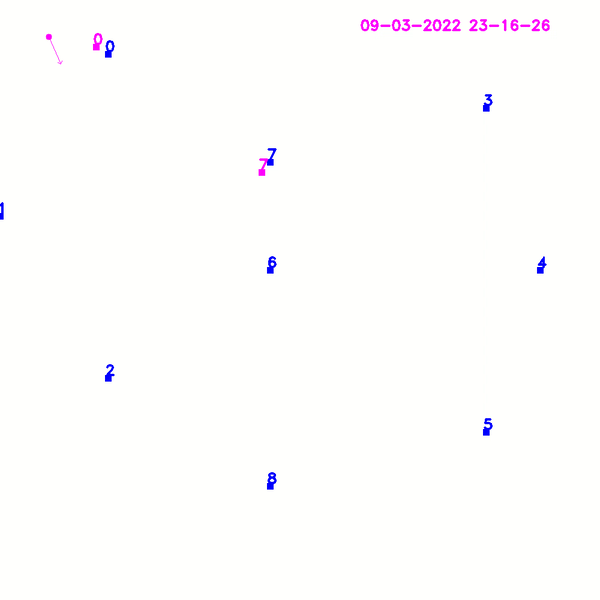
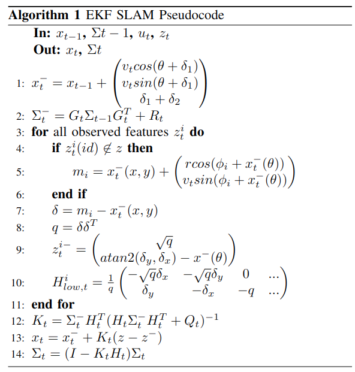
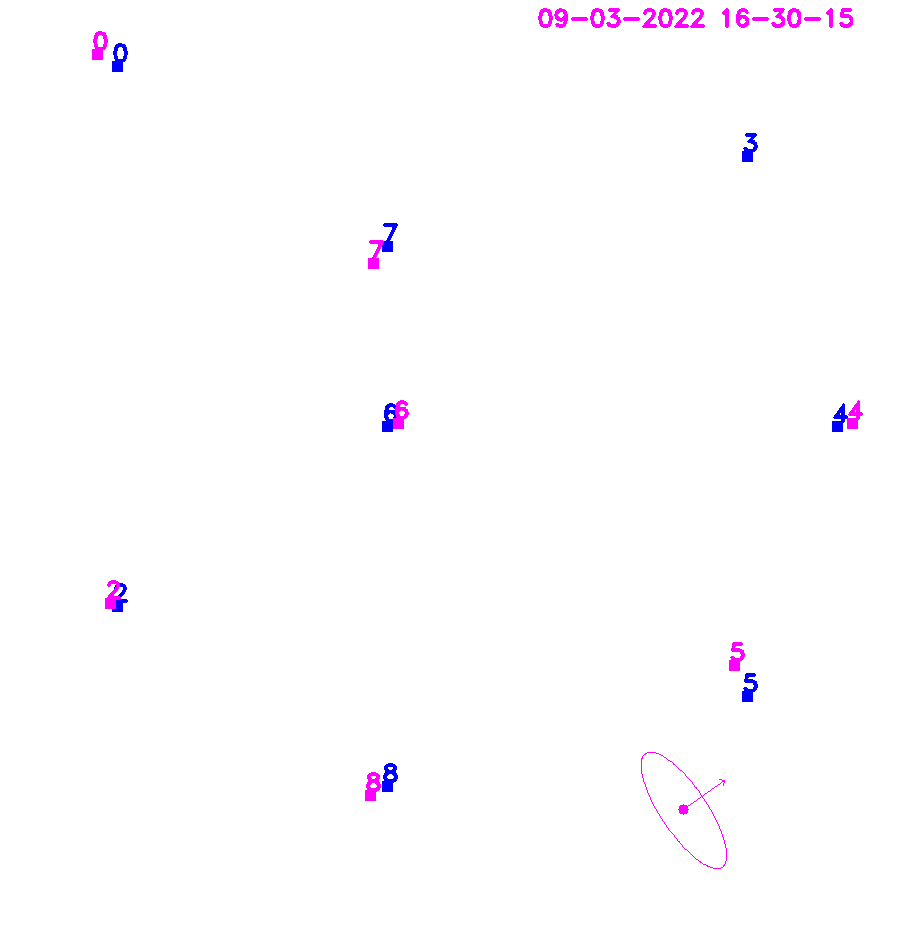

# EKF-SLAM in 2D



# Parallelized EKF-SLAM
<p align="justify">

Requirements: 
* OpenCV 
* Eigen 
* GCC 
* CMake

Compilation using cmake:
```
mkdir build
cd build
cmake ..
make
``` 

How to run (from build directory):
```
// Multithreaded
./multi_threaded_ekf_node 1
// Sequential
./multi_threaded_ekf_node 0
```

This simulation performs Simultaneous Localization and
Mapping (SLAM) of a robot in a 2D world. The robot measurement is based
on the odometry motion model, and a range-bearing sensor to observe the
landmarks. 

The problem formulation is based on Cyrill Stachniss lecture on robot
mapping [1] (University of Freiburg) as well as
'Simultaneous localization and mapping with the extended Kalman filter'
by Joan Solà [2]. The sensor data was generated by the same
professor.
</p>

## EKF-SLAM
<p align="justify">

The Extended Kalman Filter was one of the first approaches of SLAM by
performing a local linearization of a nonlinear system. It couples the
current state of the robot only to the previous state and estimates is
probability of being at the current state. The algorithm is divided into
two main steps, prediction and correction.

The state vector has a 3 + 2N length where N is the number of
landmarks. It is defined as

)

Where ) are the coordinates of the landmarks.

The covariance matrix is 2N x 2N defined as


The input vector (odometry vector) is defined as
)


The measurements come in the form of id, range and bearing
), and they are interpreted as an unordered map
in the C++ code.

Note that all the measurements must come already asscociated into the
algorithm.
</p>

### Prediction step
<p align="justify">

In the prediction step, the estimated state is computed based on the
motion model and an initial uncertainty (covariance) matrix
is predicted from previous uncertainty and the motion model jacobian
G_t.

&space;\\\\&space;&space;&space;&space;v_t&space;sin(\theta&space;&plus;&space;\delta_1&space;)&space;\\\\&space;&space;&space;&space;\delta_1&space;&plus;&space;\delta_2&space;&space;&space;&space;&space;\end{pmatrix})


The jacobian of the motion model corresponds to the top-left component
of a 3 + 2N identity matrix, and it is defined as

&space;\\\\&space;&space;&space;&space;0&space;&&space;1&space;&&space;&space;&space;v_t&space;cos(\theta&space;&plus;&space;\delta_1&space;)&space;\\\\&space;&space;&space;&space;0&space;&&space;0&space;&&space;1&space;&space;&space;&space;&space;\end{pmatrix})

At this point, it is interesting to expand the computation of the
covariance matrix and observe it can be decomposed into three parts.

^T&space;&&space;G_t^x\Sigma_{xm}\\\\(G_t^x\Sigma_{xm})^T&space;&&space;\Sigma_{mm}&space;\end{pmatrix}&space;&space;&plus;&space;R_t)

This is a possibility of parallelizing computations, as the components
do not depend on each other.
</p>

### Correction step
<p align="justify">

After the first pose and covariance estimate, the correction computes a
gain to reduce the error based on the landmark observations. As it will
be noted, parallelization can be introduced at this stage to improve the
performance.

First, if the landmark has not been initialized yet, its location within
the map is computed as the sum of the robot pose estimate plus the
relative range sensor measurement.

&space;&plus;&space;\begin{pmatrix}&space;r&space;cos(\phi_i&space;&plus;&space;x_t^-(\theta))&space;\\\\&space;v_t&space;sin(\phi_i&space;&plus;&space;x_t^-(\theta))&space;\\&space;\end{pmatrix})

In order to be able to compare the expected distance from landmark to
robot, the squared euclidean distance q is computed.

&space;\\\\&space;&space;&space;&space;q&space;&&space;=&space;\delta&space;\delta^T&space;&space;&space;&space;\end{aligned})

Once defined, the predicted measurement is given as

&space;-&space;x^-(\theta)&space;\\&space;&space;&space;&space;\end{pmatrix})

The jacobian of the predicted measurement will have the size
2Nx2N + 3. In the subcomponent for each landmark, the first three
columns refer to the derivative with respect to the robot pose. The
other two non-empty columns correspond to the observed landmark index.


It is important to note in this case, that the computation of each
landmark does not interfere with each other. Therefore the matrix $H$
can be constructed by blocks, using batches of landmark detections that
can be parallelized for computation.

Performance would benefit from this specially in the case where
landmarks and features need to be matched, which is out of the scope of
this algorithm, and simulated in the experiments as a small time delay.

The last steps of EKF SLAM are trivial and can be observed in the
algorithm pseudocode.



</p>

## EKF SLAM multithreading
<p align="justify">

As seen in the previous section, there are two main areas of
experimentation for multithreading in EKF SLAM. The first one is in the
computation of the covariance matrix prediction . The second
one is batch-computing the jacobian of the observation for each landmark
.

Two additional threads were used in order to display the robot movement
in a 2D image as well as publishing of the current time. All the writing
within threads is handled using unique locks for a data mutex in the
class instance.

The visualization looks as follows. Improvements would include plotting the landmark uncertainty.


</p>

### Parallelize covariance prediction
<p align="justify">

The parallelization of the covariance leads to four separate functions,
*GetTopLeft*, *GetTopRight*, *GetBottomLeft* and *GetBottomRight*. Each
one executed in one thread. The number of landmarks for this experiment
was set to 10, which mainly influences the size of the matrix
computation.

The average time for the multithreaded case averaged to 0.15ms while the
sequential run was an order of magnitude lower at 0.0125ms. Varying the
number of landmarks was limited by the Eigen C++ library to 100, which
made the change in performance barely noticeable for having more or less
landmarks.
</p>

### Parallelize measurement prediction jacobian
<p align="justify">

The measurement prediction jacobian was parallelized by separating
different landmark observations into different threads. As the
computation is performed in constant time, the runtime reduction is not
noticeable without a modification to the code.

A 10ms delay was added to each landmark computation, simulating the
process of matching and association in a real world system.

At maximum, six observations were made at the same time by the robot, so
having a feature batch size of one is reasonable for an eight core CPU.

Perfroming the operations sequentially lead to the addition of the
runtimes for each landmark. If the robot observes 6 landmarks, the delay
is 60.3ms, if it observes 2 landmarks, the delay is 20.3ms.

However, parallelization improved this by dividing all the work into
multiple threads, thus taking always 10.3ms no matter how many landmarks
are seen.
</p>

### Results and discussion
<p align="justify">

The following table shows
the results mentioned earlier, demonstrating the two sides of
multithreaded programming. It can be observed how thread creation is
expensive. Spawning multiple threads for small problems reduces
efficiency by increasing throughput. Meanwhile, computations that
require time such as feature matching and detection in a robot SLAM
system can be spread across multiple threads. In such a case, an
increase in throughput also means an increase in performance.

|               | Covariance Computation (ms) | H_t Computation (ms)     |
|---------------|-----------------------------|--------------------------|
| Single thread | 0.0125                      | n of observations * 10.3 |
| Multi thread  | 0.12                        | 10.3                     |

</p>

# References
<a id="1">[1]</a> 
Cyrill Stachniss.
EKF-SLAM
https://www.youtube.com/watch?v=X30sEgIws0g&t=11s

<a id="2">[2]</a> 
Joan Solà.
Simultaneous localization and mapping with the extended Kalman filter.
https://www.iri.upc.edu/people/jsola/JoanSola/objectes/curs_SLAM/SLAM2D/SLAM%20course.pdf
